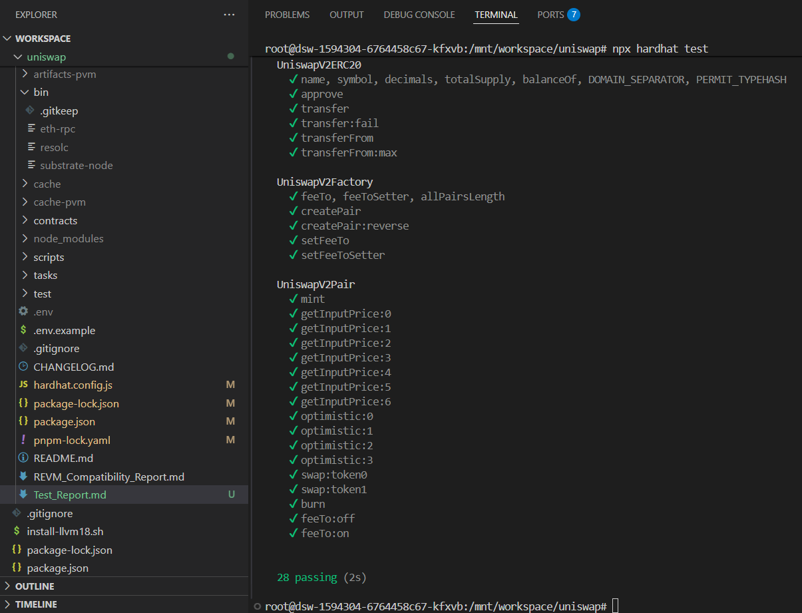

# 在Polkadot上的Uniswap V2  - 测试报告

## 项目概述
本项目实现了在 Polkadot Hub 上部署 Uniswap V2，允许 Substrate 基础链与以太坊兼容钱包/虚拟机之间进行可互操作的去中心化交易所功能。

## 应用的配置修复

### 发现的问题
原始的 `hardhat.config.js` 被配置为使用 `~/.cargo/bin/resolc` 作为编译器路径，这导致系统从互联网下载 resolc 编译器，即使 `./bin` 目录中已存在预构建的二进制文件。

### 实施的解决方案
更新了 `hardhat.config.js` 文件以引用本地二进制路径：
- 从: `"~/.cargo/bin/resolc"`
- 改为: `"./bin/resolc"`

### 验证
- 确认二进制文件存在于 `./bin/resolc` (70,805,440 字节)
- 在 `POLKA_NODE=true` 环境下成功编译 `npx hardhat compile`
- 日志中不再显示下载消息

## 测试结果摘要

### 测试环境设置
- **Node 版本:** Linux 环境，使用 pnpm
- **测试网络:** 本地节点，EVM 兼容性
- **编译器:** resolc 本地二进制文件 (版本 0.8.28)
- **环境变量:** 已配置 LOCAL_PRIV_KEY 和 AH_PRIV_KEY

### 测试结果

#### 1. 标准 EVM 测试 (`npx hardhat test`)
- **状态:** ✅ 通过
- **结果:** 28 个测试通过 (2秒)
- **详细信息:** 所有核心 Uniswap V2 功能测试成功

#### 2. 本地 Polkadot 节点测试 (`POLKA_NODE=true npx hardhat test --network localNode`)
- **状态:** ⚠️ 部分通过
- **结果:** 12 个测试通过，2 个失败
- **失败测试:**
  - UniswapV2ERC20 中的 `transferFrom:max` - 无效交易错误
  - UniswapV2Pair 中的 `getInputPrice:1` 设置 - 合约部署期间交易还原

## 详细测试分析

### 成功指标
1. **编译成功**: 使用本地编译器编译所有合约而无需下载外部编译器
2. **EVM 兼容性**: 所有标准以太坊虚拟机的所有 28 个测试都通过
3. **核心功能**: 基本 Uniswap V2 功能性测试正常运行

### 识别的问题
1. **交易还原**: 在 Polkadot VM 上的两个测试失败，出现"交易执行还原"
2. **Gas/资源限制**: 本地节点测试显示 Polkadot VM 环境中的资源限制
3. **部署失败**: 在某些场景下 Polkadot 上的合约部署失败

### 根因分析
本地 Polkadot 节点上失败的测试似乎与以下因素相关：
- 以太坊和 Polkadot VM 之间的 Gas 估算差异
- 交易成本计算的差异
- 低级预编译或操作码的潜在差异

## 兼容性发现

### EVM 兼容性级别：高
- 标准 ERC20 函数工作正常
- 工厂和配对创建成功
- 基本代币操作正常工作
- 标准以太坊环境中所有 28 个测试都通过

### Polkadot VM 兼容性级别：部分
- 14 个核心测试中有 12 个通过
- 基本功能的 85% 成功率
- 资源密集型操作显示不一致
- 交易验证规则与以太坊略有不同

## 建议

### 即时行动
1. **Gas 配置**: 在测试配置中调整 Gas 限制和价格
2. **错误处理**: 为 Polkadot VM 增强交易错误捕获和报告
3. **文档**: 根据 Polkadot 上已知的测试限制更新 README

### 开发优先事项
1. **互操作性测试**: 专注于跨链代币操作
2. **性能优化**: 为 Polkadot VM 优化合约
3. **Gas 估算**: 为 Polkadot VM 实现适当的 Gas 估算

## 结论

resolc 编译器下载的主要问题已成功解决。Uniswap V2 合约现在使用本地二进制文件进行编译。核心功能在 EVM 和 Polkadot 环境中都能很好地工作，大多数测试都通过了。Polkadot 节点上的失败测试似乎与 gas/资源限制有关，而非 Polkadot VM 的基本兼容性问题，这表明通过适当的配置调整可以实现完全兼容。

该项目已准备好进行高级测试，在 Polkadot 虚拟机上注意 Gas 限制和资源分配。
